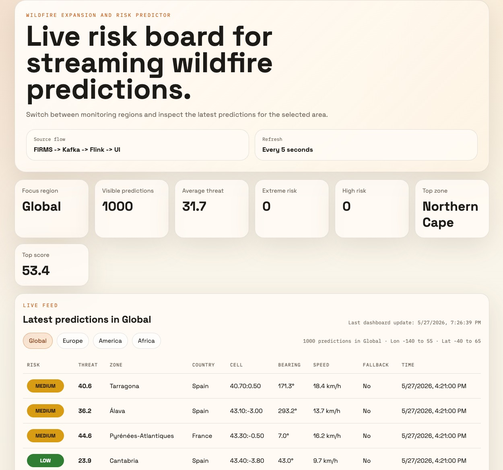

# Wildfire Expansion and Risk Predictor

Streaming project for estimating wildfire risk and likely spread direction from fire and weather data, then displaying the predictions in a local dashboard.

## Team

- Tatoiu Tea-Eliza
- Grigore Andreea-Isabela
- Potlog Lorena-Elena

## Dashboard UI

Screenshot of the live wildfire risk dashboard (`http://localhost:7070`):



## Demo 

Two screen recordings of the dashboard are in [`src/main/resources/docs/demo/`](src/main/resources/docs/demo/).

| Title | What it shows | Watch |
|-------|---------------|-------|
| **Live Data Demo** | Real-time pipeline: NASA FIRMS + OpenWeather → Kafka → Flink → dashboard | [Open video](https://github.com/LorenaPotlog/tpd-wildfire-predictions/blob/main/src/main/resources/docs/demo/demo-real-data.mp4) |
| **Mock Seeder Demo** | Scripted demo with `WildfireSeederApp` — no API keys, predictable risk transitions | [Open video](https://github.com/LorenaPotlog/tpd-wildfire-predictions/blob/main/src/main/resources/docs/demo/demo-seeder.mp4) |

## What This Project Does

The project has three main runtime pieces:

- `WildfireLiveIngestionApp`
  Polls NASA FIRMS and OpenWeather, then writes live fire and weather events into Kafka.
- `WildfireRiskJob`
  Runs in Flink, consumes Kafka fire/weather events, calculates wildfire risk predictions, and publishes them to the `wildfire-risk-predictions` Kafka topic.
- `PredictionDashboardServer`
  Reads prediction events from Kafka and serves the local dashboard UI on `http://localhost:7070`.

There is also one demo tool:

- `WildfireSeederApp`
  Can publish fake/demo data when you do not want to depend on live external APIs.

## End-To-End Flow

### Live mode

```text
NASA FIRMS + OpenWeatherMap
        -> Kafka
        -> Apache Flink
        -> wildfire-risk-predictions
        -> local dashboard
```

### Mock/demo mode

```text
WildfireSeederApp
        -> wildfire-risk-predictions
        -> local dashboard
```

## Operating Modes

This repo supports three distinct ways to run the app:

### 1. Live streaming

Use this when you want real data from NASA FIRMS and OpenWeather.

Needed:

- Docker stack
- Flink risk job
- dashboard server
- live ingestion app
- valid `FIRMS_MAP_KEY`
- valid `OPENWEATHER_API_KEY`

### 2. Mock demo seeder

Use this when you want a controlled 3-4 minute recording/demo with predictable low/medium/high/extreme transitions.

Needed:

- Docker stack
- dashboard server
- mock-demo seeder

Not needed:

- live ingestion app
- Flink risk job
- external API keys

The mock demo publishes predictions directly to `wildfire-risk-predictions`.

### 3. Sample-input seeder

Use this when you want the old sample resource behavior.

Needed:

- Docker stack
- Flink risk job
- dashboard server
- seeder in `sample-inputs` mode

The sample-input seeder publishes fire/weather inputs, not final predictions, so it still requires the Flink job.

## Kafka Topics

- `firms-hotspots`
- `weather-observations`
- `wildfire-risk-predictions`

## Configuration

Copy `.env.example` to `.env`, then fill in the live keys if you want real data:

```bash
cp .env.example .env
```

Important values:

- `FIRMS_MAP_KEY`
  NASA FIRMS API key for live ingestion.
- `OPENWEATHER_API_KEY`
  OpenWeather API key for live ingestion.
- `FIRMS_AREA`
  One or more FIRMS bounding boxes.
- `INGEST_POLL_SECONDS`
  How often live ingestion polls external APIs.
- `DASHBOARD_PORT`
  Local dashboard port.

### `FIRMS_AREA` format

Each area uses:

```text
west,south,east,north
```

Multiple areas are separated with `;`.

Example:

```env
FIRMS_AREA="-10,35,5,44;5,41,20,48;19,34,30,49;12,47,25,56;-125,32,-113,42.5"
```

That means the app will poll multiple regions, for example parts of Europe and the western United States.

## Requirements

- Java 17+
- Maven
- Docker and Docker Compose
- NASA FIRMS API key for live ingestion
- OpenWeatherMap API key for live ingestion

## Common Setup

### 1. Start infrastructure

```bash
docker compose up -d
```

### 2. Build the project

```bash
mvn clean package
```

### 3. Open the dashboard

The dashboard URL is:

```text
http://localhost:7070
```

## Live Streaming Runbook

Use this when you want real live data.

### 1. Start infrastructure

```bash
docker compose up -d
```

### 2. Build the jar

```bash
mvn clean package
```

### 3. Copy Natural Earth boundary data into the Flink containers

This improves zone/country matching.

```bash
docker exec wildfire-jobmanager mkdir -p /tmp/natural-earth
docker exec wildfire-taskmanager mkdir -p /tmp/natural-earth
docker cp data/natural-earth/. wildfire-jobmanager:/tmp/natural-earth/
docker cp data/natural-earth/. wildfire-taskmanager:/tmp/natural-earth/
```

### 4. Copy the jar to Flink

```bash
docker exec wildfire-jobmanager mkdir -p /opt/flink/usrlib
docker cp target/wildfire-streaming-1.0.0-jar-with-dependencies.jar wildfire-jobmanager:/opt/flink/usrlib/
```

### 5. Submit the Flink job

```bash
docker exec wildfire-jobmanager flink run -d \
  /opt/flink/usrlib/wildfire-streaming-1.0.0-jar-with-dependencies.jar \
  --bootstrap-servers=kafka:29092 \
  --natural-earth-admin0-path=/tmp/natural-earth/admin0/ne_10m_admin_0_countries.shp \
  --natural-earth-admin1-path=/tmp/natural-earth/admin1/ne_10m_admin_1_states_provinces.shp
```

### 6. Start the dashboard

```bash
java -cp target/wildfire-streaming-1.0.0-jar-with-dependencies.jar \
  ro.unibuc.bpd.wildfire.dashboard.PredictionDashboardServer
```

### 7. Start live ingestion

```bash
set -a
source .env
set +a
java -cp target/wildfire-streaming-1.0.0-jar-with-dependencies.jar \
  ro.unibuc.bpd.wildfire.WildfireLiveIngestionApp
```

### Notes

- The UI refreshes every 5 seconds.
- Live ingestion frequency is controlled by `INGEST_POLL_SECONDS`.
- If the dashboard looks static, it may still be refreshing correctly while waiting for fresh external events.

## Mock Demo Runbook

Use this when you want a predictable recording/demo with changing wildfire severity.

### What it does

The default `WildfireSeederApp` mode publishes a scripted prediction sequence directly into `wildfire-risk-predictions` for about 3.5 minutes.

It includes different incident arcs such as:

- a low-risk wildfire
- a medium-risk wildfire
- a wildfire escalating from medium to high
- a wildfire escalating to extreme
- a flare-up that later cools down

### 1. Start infrastructure

```bash
docker compose up -d
```

### 2. Build the jar

```bash
mvn clean package
```

### 3. Start the dashboard

```bash
java -cp target/wildfire-streaming-1.0.0-jar-with-dependencies.jar \
  ro.unibuc.bpd.wildfire.dashboard.PredictionDashboardServer
```

### 4. Run the scripted mock demo

```bash
java -cp target/wildfire-streaming-1.0.0-jar-with-dependencies.jar \
  ro.unibuc.bpd.wildfire.WildfireSeederApp
```

### Optional demo tuning

Longer demo:

```bash
java -cp target/wildfire-streaming-1.0.0-jar-with-dependencies.jar \
  ro.unibuc.bpd.wildfire.WildfireSeederApp \
  --demo-duration-seconds=240
```

More frequent demo updates:

```bash
java -cp target/wildfire-streaming-1.0.0-jar-with-dependencies.jar \
  ro.unibuc.bpd.wildfire.WildfireSeederApp \
  --demo-step-seconds=8
```

## Sample-Inputs Seeder Runbook

Use this if you want the original sample fire/weather input behavior instead of the scripted direct-prediction demo.

### 1. Start infrastructure

```bash
docker compose up -d
```

### 2. Build the jar

```bash
mvn clean package
```

### 3. Start the Flink job

Use the same Flink submission steps from the live runbook.

### 4. Start the dashboard

```bash
java -cp target/wildfire-streaming-1.0.0-jar-with-dependencies.jar \
  ro.unibuc.bpd.wildfire.dashboard.PredictionDashboardServer
```

### 5. Run the seeder in sample-input mode

```bash
java -cp target/wildfire-streaming-1.0.0-jar-with-dependencies.jar \
  ro.unibuc.bpd.wildfire.WildfireSeederApp \
  --demo-mode=sample-inputs
```

## Stopping Things

### Stop local Java processes

Stop the terminal sessions running:

- `PredictionDashboardServer`
- `WildfireLiveIngestionApp`
- `WildfireSeederApp`

### Stop the Flink job

List running jobs:

```bash
docker exec wildfire-jobmanager flink list
```

Cancel a job:

```bash
docker exec wildfire-jobmanager flink cancel <job-id>
```

### Stop the Docker stack

```bash
docker compose down
```

## Monitoring

- Flink UI: `http://localhost:8081`
- Grafana: `http://localhost:3000`
- Prometheus: `http://localhost:9090`

## Troubleshooting

### Dashboard is up but empty

Possible causes:

- live ingestion is not running
- Flink job is not running
- the seeder mode does not match the rest of the stack
- there are no new live events for the selected region

### Dashboard refreshes but `Last dashboard update` does not move

This usually means:

- the page is refreshing
- but no new prediction event has arrived yet

### America or Africa shows nothing

The UI region selector only filters what the backend has already produced.
If a region is empty, check `FIRMS_AREA` and make sure live ingestion is polling that part of the world.
